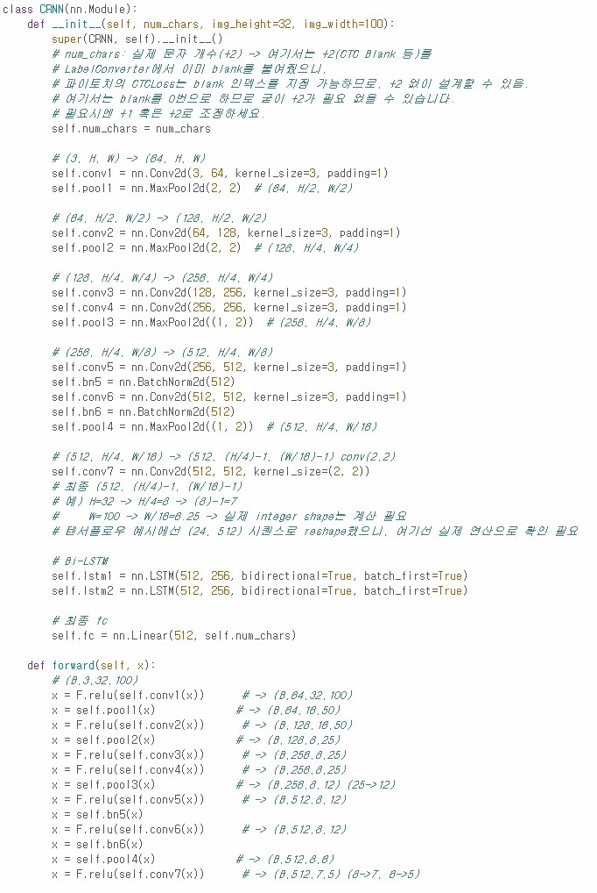

# AIFFEL Campus Online Code Peer Review Templete
- 코더 : 이유찬
- 리뷰어 : 최재훈


# PRT(Peer Review Template)
- [x]  **1. 주어진 문제를 해결하는 완성된 코드가 제출되었나요?**
    - 직접 훈련하여 시각화를 통해 결과를 확인하였고 pretrained 모델을 사용하여 실생활 테스트도 확인하였다.
      
    
- [x]  **2. 전체 코드에서 가장 핵심적이거나 가장 복잡하고 이해하기 어려운 부분에 작성된 주석 또는 doc string을 보고 해당 코드가 잘 이해되었나요?**
    - 해당 프로젝트에서 중요한 RCNN모델을 잘 구성하였고 이를 통해 모델 학습 또한 잘 수행하였다.  
    또한 코드에 주석을 달아놔서 다른 사람이 보기에 이해하기 쉽도록 하였다.
    

- [ ]  **3. 에러가 난 부분을 디버깅하여 문제를 해결한 기록을 남겼거나 새로운 시도 또는 추가 실험을 수행해봤나요?**
     2

- [ ]  **4. 회고를 잘 작성했나요?**
    

- [x]  **5. 코드가 간결하고 효율적인가요?**
    - 필요한 모델과 함수들을 모듈화하여서 중복되지 않게 잘 작성하였다.


# 회고(참고 링크 및 코드 개선)
```
코드를 깔끔하게 정리하신 것 같습니다. 주석들이 잘 되어있어서 코드를 보는데 한결 수월했습니다.
Early stopping을 풀고 실험을 하셨으면 어떤 결과가 나올지 궁금합니다.
```
